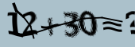

# orc

### orc验证码识别

```python
import tesserocr
from PIL import Image

image = Image.open('code.jpg')
print(type(image))
result = tesserocr.image_to_text(image)

print(result)


```


---

# 多余线条 二维码

```python
import tesserocr
from PIL import Image

image = Image.open('code2.jpg')

image = image.convert('L')
threshold = 127
table = []
for i in range(256):
    if i < threshold:
        table.append(0)
    else:
        table.append(1)

image = image.point(table, '1')
result = tesserocr.image_to_text(image)
print(result)

```


```python
# 灰度图像
image = image.convert('L')
image.show()

#二值化
image = image.convert('1')
image.show()


#  #
image = image.convert('L')
threshold = 80
table = []
for i in range(256):
    if i < threshold:
        table.append(0)
    else:
        table.append(1)
"""
table是一个列表，其中每个元素表示一个灰度级别的像素值。
table列表的长度为256，对应于图像的所有灰度级别。根据您的代码，如果灰度级别小于阈值threshold，则将其映射为0；否则，将其映射为1。
"""
image = image.point(table, '1')
image.show()
```

---

# ddddocr
python <= 3.9

```python
import ddddocr

ocr = ddddocr.DdddOcr()

#通过在初始化ddddocr的时候使用beta参数即可快速切换新模型
#ocr = ddddocr.DdddOcr(beta=True)
with open("test.jpg", 'rb') as f:
    image = f.read()

res = ocr.classification(image)
print(res)

```



---
#  目标检测部分

```python

import ddddocr
import cv2

det = ddddocr.DdddOcr(det=True)

with open("1.png", 'rb') as f:
    image = f.read()

poses = det.detection(image)
print(poses)

# cv2.imread()是OpenCV库中用于读取图像的函数
im = cv2.imread("1.png")

"""
cv2.rectangle()函数用于绘制矩形，它接受以下参数：

im：要在其上绘制矩形的图像
(x1, y1)：矩形的左上角坐标
(x2, y2)：矩形的右下角坐标
color=(0, 0, 255)：矩形的颜色，使用BGR格式表示（这里是蓝色）
thickness=2：矩形边缘的粗细
"""
for box in poses:
    x1, y1, x2, y2 = box
    im = cv2.rectangle(im, (x1, y1), (x2, y2), color=(0, 0, 255), thickness=2)

cv2.imwrite("2.jpg", im)
    
```


---

## 滑动拼图验证码


```python
import ddddocr
det = ddddocr.DdddOcr(det=False, ocr=False)

with open('target.png', 'rb') as f:
    target_bytes = f.read()

with open('background.png', 'rb') as f:
    background_bytes = f.read()

# 提示：如果小图无过多背景部分，则可以添加simple_target参数， 通常为jpg或者bmp格式的图片
# res = slide.slide_match(target_bytes, background_bytes, simple_target=True)
res = det.slide_match(target_bytes, background_bytes)

print(res)


```

 


---
# 算法2
一张图为带坑位的原图
一张图为原图
```python
import cv2
import ddddocr
slide = ddddocr.DdddOcr(det=False, ocr=False)

with open('3.jpg', 'rb') as f:
    target_bytes = f.read()

with open('4.jpg', 'rb') as f:
    background_bytes = f.read()


res = slide.slide_comparison(target_bytes, background_bytes)

print(res)

```
 


---
# tesseract-ocr 安装
https://www.jianshu.com/p/93ab58dea50f
https://digi.bib.uni-mannheim.de/tesseract/

---

# pytesseract

```python
from PIL import Image
import pytesseract
#pip install tesseract-ocr
# 用pytesseract识别验证码
# 1：打开需要识别的图片
image = Image.open('code.jpg')
# 2：pytesseract识别为字符串
code = pytesseract.image_to_string(image)
# 3：输出识别的内容
print(code)

```
